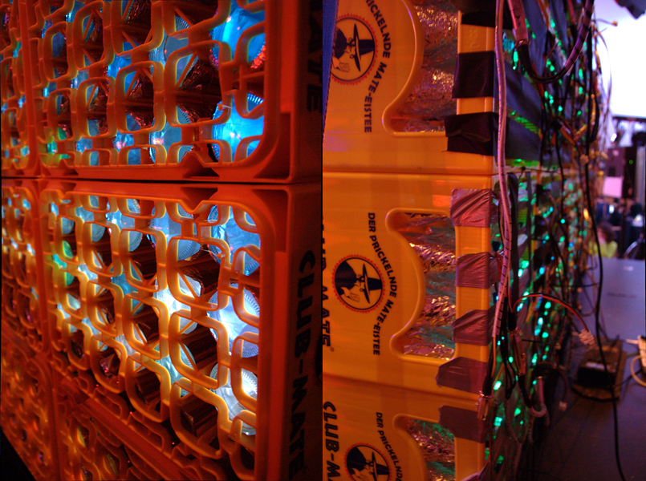

Mate Light
==========

.. figure:: ./pics/heise-make-32c3-1-small.jpg
   :target: http://www.heise.de/newsticker/meldung/32C3-Diese-Maker-Projekte-gab-es-auf-dem-Chaos-Communication-Congress-zu-sehen-3057100.html&hg=1&hgi=9&hgf=true
   :align: center
   :alt: A matelight at 32C3. Foto: Rebecca Husemann / Make Magazin.

   Foto: Rebecca Husemann / Make Magazin. `Link`_

Transform a bunch of empty mate crates to a huge display using a 15 year old laptop, a 13US$ microcontroller board and a couple of cheap chinese christmas lights.

Hardware Setup
--------------
Each bottle contains a LED with a WS2801 driver. Each crate contains a chain of 20 LEDs with a 9 pin SUB-D connector. A wiring harness connects 8 crates in series to a TI Stellaris Launchpad. The Launchpad has four hardware SPI interfaces which can control one wiring harness each. The controller board is connected to a ThinkPad T22 running the control program via USB.

   Foto: Rebecca Husemann / Make Magazin. `Link`_
   
.. _`Link`: http://www.heise.de/newsticker/meldung/32C3-Diese-Maker-Projekte-gab-es-auf-dem-Chaos-Communication-Congress-zu-sehen-3057100.html

1. Take a mate bottle and wrap it in aluminum foil
2. Poke a 12mm hole in the lid
3. Put it in a crate
4. Repeat from step 1
5. Stick a loop of LEDs through the lids of the bottles like this:
   .. code::
             ┏━━━━━━━━━━━━━━━━━━━┓
     {start}→┃ ○ → ○ → ○ → ○ → ○ ┃
             ┃                 ↓ ┃
     {  end}←┃ ○   ○ ← ○ ← ○ ← ○ ┃
             ┃ ↑   ↓             ┃
             ┃ ○   ○ → ○ → ○ → ○ ┃
             ┃ ↑               ↓ ┃
             ┃ ○ ← ○ ← ○ ← ○ ← ○ ┃
             ┗━━━━━━━━━━━━━━━━━━━┛

6. Repeat from step 1
7. Stack up a bunch of these crates and tie them together with zip ties and straps
8. Connect all the wires together (mis-)using wonderful XLR connectors
9. ???
10. PROFIT!!

Software
--------
The control software is a Python script accepting framebuffer data via UDP and text via TCP. Since it is run on a 900MHz Pentium 3, the two most time-critical pieces, pixel font rendering for scrolling text and USB communication are written in C and called from the Python script via ctypes.

Architecture
~~~~~~~~~~~~
The server listens on TCP and UDP ports 1337. Any text arriving through TCP is rendered as a marquee, interpreting ANSI escape sequences (colors, blink etc.). The TCP interface accepts one line per connection queuing lines in times of high demand. If there is no more text to render, the system defaults to a list of lines to scroll that is read from the text file ``default.lines``. When the end of that list has been reached, the file is automatically reloaded enabling run-time configuration.

The UDP port accepts CRAP, our Custom advanced video stReAming Protocol. A CRAP packet contains three bytes of RGB data per pixel in 16 rows of 40 columns (i.e. ``[R0,0 G0,0 B0,0 R0,1 G0,1 B0,1 ... R0,39 G0,39 B0,39 R1,0 G1,0 B1,0 ... R15,39 G15,39 B15,39]``). A CRC-32 can optionally be added at the end of the packet. A CRAP connection is considered terminated when no packets are received for an interval of by default 3 seconds. CRAP has precedence over text scrolling, any text scrolling when a CRAP connection is initiated is paused and incoming text during a CRAP connection is put into a queue. When multiple CRAP clients are connected, the system by default rotates every 30 seconds to a random new client. 

Utilities
~~~~~~~~~
As written before, some parts of these utilities have been factored out into C code. In order to run the utilities requiring these parts (which would otherwise terminate with a python ``OSError`` mentioning some ``.so`` file), you must first build the C backend libraries by running ``make`` inside the ``host`` directory.

``server.py``
'''''''''''''
The matelight server application lives in ``server.py``. If you just run this, a matelight server including TCP and UDP/CRAP interfaces is started. The server application supports forwarding the displayed image (including not only incoming CRAP but also scrolled text) via CRAP to the network or localhost. This is configured with ``crap_fw_addr`` and ``crap_fw_port`` in the server config file. If no matelight is connected to your machine, a warning is printed, but the server is left running since this monitoring feature can be used for local testing.

``viewer.py``
'''''''''''''
The viewer is a short python script rendering CRAP on your terminal using Unicode and the extended terminal color palette introduced by xterm. This is useful e.g. when diagnosing a running matelight server over the network (through its monitoring port) or when developing CRAP clients. This tool can be run directly with a CRAP client or with the matelight server in between (e.g. if you want to play with marquee rendering, which is done by the matelight server).

If you try this utility and don't see any colors or reduced on your terminal, have a close look at anything supposed to pass through this tool's output to your terminal such as ``ssh``, ``cat`` and ``tmux``. Some of these tools will filter/downconvert these extended color sequences depending on the ``$SHELL`` environment variable they encounter.

``gifstream.py``
''''''''''''''''
This utility reads a bunch of CRAP, e.g. from a running matelight server's monitoring port and converts it to a GIF stream (yes, you read that correctly) that is served over a built-in HTTP server (by default running on port 5000). This GIF stream can be viewed with most browsers.

``gifserver.py``
''''''''''''''''
This utility launches a local webserver (by default running on port 5000) presenting an upload form where one may upload a GIF file. An uploaded GIF file is read and streamed to a matelight via CRAP. If a GIF is uploaded while another is already being played, the currently played one is interrupted and replaced by the new one. To prevent a very easy DOS attack, GIF frame durations are capped at 10s.

Build your own
''''''''''''''
Spitting out TCP and UDP is pretty much trivial in any programming environment, still there is a bunch of examples below. In case you're using python, you can find one possible CRAP client/server implementation in ``host/crap.py``.

TODO
----
It would be neat to have a somewhat saner config system using e.g. python's ``configparser`` module with defaults for most things. Also it would be useful to have command line switches to override some of these settings. Pull requests are appreciated!

Related Projects
----------------
* `A Python script that plays gifs over CRAP`_
* `An HTML5 CRAP emulator`_
* `A CRAP client for node.js`_
* `Webcam streaming on Mate Light`_
* `A game programming framework for Mate Light`_
* `Snake for Mate Light`_
* `Game of Life for Mate Light`_
* `Mate Light Android App`_
* `Blinkenlights for Mate Light`_
* `Postillon Newsticker for Matelight`_
* `Movie Streaming and Live 3D Raytracing for Mate-Light in Javascript`_
* `An audio spectrum analyzer`_
* `A Unity 3D backend`_
* `Advanced Conway's Game of Life`_
* `How to CRAP in bash because nc is for noobs`_

As featured on…
---------------
* Heise_
* Hackaday_
* `Heise again`_
* `Deutschlandfunk`_

.. _Heise: http://www.heise.de/newsticker/meldung/Code-Red-Aktivisten-schlagen-gegen-das-Ueberwachungsimperium-zurueck-2614513.html
.. _Hackaday: http://hackaday.com/2014/03/19/massive-led-display-makes-use-of-reused-soda-bottles/
.. _`Heise again`: http://www.heise.de/newsticker/meldung/32C3-Diese-Maker-Projekte-gab-es-auf-dem-Chaos-Communication-Congress-zu-sehen-3057100.html
.. _`Deutschlandfunk`: https://youtu.be/ffvNsbZeuaw
.. _`A Python script that plays gifs over CRAP`: https://github.com/uwekamper/matelight-gifplayer
.. _`An HTML5 CRAP emulator`: https://github.com/sodoku/matelightemu
.. _`A CRAP client for node.js`: https://github.com/sodoku/node-matelight
.. _`Postillon Newsticker for Matelight`: https://gist.github.com/XenGi/9168633
.. _`Webcam streaming on Mate Light`: https://github.com/c-base/matetv
.. _`A game programming framework for Mate Light`: https://github.com/c-base/pymlgame
.. _`Snake for Mate Light`: https://github.com/c-base/pymlsnake
.. _`Game of Life for Mate Light`: https://github.com/igorw/conway-php#mate-light
.. _`Blinkenlights for Mate Light`: https://github.com/igorw/matelight-blm
.. _`Mate Light Android App`: https://github.com/cketti/MateLightAndroid
.. _`Movie Streaming and Live 3D Raytracing for Mate-Light in Javascript`: https://github.com/MichaelKreil/matelight-playground
.. _`An audio spectrum analyzer`: https://github.com/c-base/mlaudiospectrum
.. _`A Unity 3D backend`: http://firepunchd.tumblr.com/post/123631124063/every-pixel-is-sacred-on-a-40x16-display-you-have
.. _`Advanced Conway's Game of Life`: https://github.com/vileda/golGL
.. _`How to CRAP in bash because nc is for noobs`: https://gist.github.com/anonymous/0299b536dabd8ee59529

